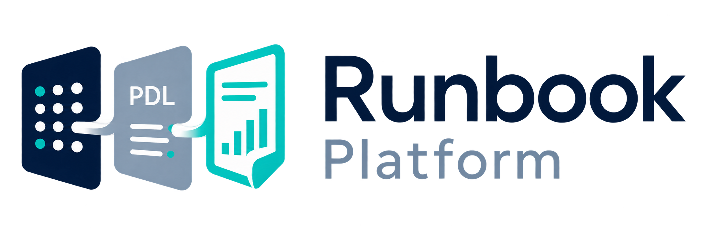

# Runbook Platform

<p></p>

Runbook is a Python-native reporting platform that turns curated data into
reproducible static and interactive reports. Analysts write normal Python for
calculations, tables, and plots; Runbook pins the data used and can render the
same report as HTML or Dash.

The v0.3.2 presentation model has one report definition and two peer
renderers: ordinary tables become static HTML tables or native static Dash
tables, while AG Grid is used only when a report explicitly opts into an
interactive table. Links are semantic table metadata, and generated plot
destinations have deterministic standalone HTML pages. Report hosts own Dash
routes; the normal reporting flow does not use an iframe.

The shortest path is:

```text
choose a dataset -> write Python -> create artifacts -> compose a Report -> preview
```

Start with the [analyst guide](docs/getting-started.md), then see the
[notebook research guide](docs/sdk-and-notebooks.md), [reports](docs/reports.md),
[data and snapshots](docs/data.md), and the [Operations UI](docs/operations.md).
Platform owners should use the
[deployment guide](docs/deployment.md).

Worked [report recipes](docs/reports.md#reports-cookbook), including the
[linked-table golden report](docs/reports.md#semantic-table-links), and [ingestion
recipes](docs/source-adapters-and-curation.md#write-an-ingester-the-sourceadapter-contract)
are linked from the analyst journey.

## Run the local example

The repository uses Pixi and Python 3.11:

```bash
pixi install
pixi run docs
pixi run test
```

For a local service, configure PostgreSQL and the default `file:.runbook`
store, apply the schema, import the checked-in demo configuration, and start
the service and worker runner:

```bash
runbook-services db upgrade
runbook-services config import
runbook-services serve
runbook-services run --workers 2 --poll-interval 5
```

The [CLI reference](docs/cli.md) explains each command and the
[deployment guide](docs/deployment.md) covers a repeatable internal install.

A report is ordinary Python composed with the high-level layout API:

```python
from runbook.sdk import plot_line
from runbook.sdk.layout import Report

figure = plot_line(frame[["price"]], title="Price")
ref = ctx.artifact.plot(figure, name="price")
page = Report("Prices")
with page.section("Summary") as section:
    with section.grid(columns=1) as grid:
        grid.plot(ref)
```

## Packages

The repository is a small dependency chain:

```text
runbook-core -> runbook-data -> runbook-sdk
     |
     +------> runbook-services

runbook-worker composes core, data, SDK, and services
```

`runbook-core` contains contracts and analyst helpers; `runbook-data` acquires
and curates datasets; `runbook-sdk` executes reports, stores artifacts, and
renders HTML; `runbook-services` provides the PostgreSQL API and Operations UI;
and `runbook-worker` executes one queued run at a time. Reports are external
templates selected by profile and do not call source systems.

## Documentation

- [Getting started](docs/getting-started.md)
- [Core concepts](docs/concepts.md)
- [Report authoring](docs/reports.md)
- [Composable layouts](docs/composable-report-layouts.md)
- [Plotting helpers](docs/plotting-helpers.md)
- [Table templates](docs/table-templates.md)
- [Data and snapshots](docs/data.md)
- [Operations](docs/operations.md)
- [Source adapters](docs/source-adapters-and-curation.md)
- [Interactive reports](docs/pdl-interactive.md)
- [API and CLI reference](docs/api.md), [CLI](docs/cli.md)

See [CONTRIBUTING.md](CONTRIBUTING.md) and [SECURITY.md](SECURITY.md) for
project-wide policies.

## License

Copyright 2026 leeft95 and contributors. Licensed under the Apache
License, Version 2.0. See [LICENSE](LICENSE).
